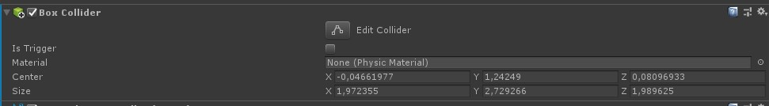
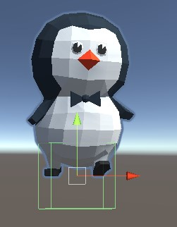
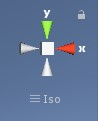
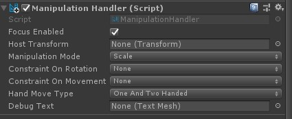

# Task 2- Creating an application

We start by adding a 3D model we can manipulate. In this case we will use Chester, the cute penguin, made by Claudelle Girard. You can download Chester :penguin: from the root folder of the repository (https://github.com/grynag/booster-mr-2019/blob/master/chester.fbx). After downloading it, add the model to the project under assets.  

:pencil2: Create an empty object in the Hierarchy and call it something like *SceneContent*. Add Chester under it. Move Chester so that he is visible in the camera (4 meters away is a good starting position). Double click **Main Camera** in the hierarchy window to get a camera preview. 

He is also a bit large, so I suggest scaling him down to 0,25 in all axis. 

:information_source: If you are new to Unity: a component inherit the properties of it's parent. That means that if the *SceneContent* component has a position, Chester's default position will be inherited from the parent. 

To interact with Chester we need to add a collider to him. We do that by clicking on him in either the hierarchy or the scene panel and clicking *Add new component* in the inspector. Choose physic, and select *Box collider*. The box collider will be a lot smaller than Chester, so we need to adjust it. To do so click on *Edit collider* in the inspector:  
.

:information_source: If the inspector view is blank, click on Chester in the Hierarchy view. 

When you click on *Edit collider* a green square will appear in the Scene view. From here you can use the small squares to drag the collider and make it large enough (Chester should be inside it)  
.

To make the job easier, change the camera angle to see Chester from the front, the side and under or top
.

Next let's use the *ManipulationHandler.cs*-script.

:pencil2: Search for *Manipulationgandler* in the project panel and drag and drop it inside Chester's inspector window. 

A new set of options will appear. 

.

Take a look through the different options. The MRTK takes care of the events for us and allows us to use the HoloLens gestures to manipulate the 3d-object. 

Set the **Hand Move Type** to One handed only

Duplicate Chester and place the two Chesters side by side. Change the **Hand Move Type** to Two handed only. 

Next let's add tool tips to the Chester's to indicate who's who. 

:pencil2: Search for **Simple line ToolTip** in the **Project view**. Drag it into the scene under **Scene content**. Under **Tool tip connector** in the inspector, add Chester's wingtip by pressing the small circle next to **target** and select one of the wingtips. Move the ToolTip to a "sensible" location. 
Under **Tool Tip Script -> Content settings** add text (ex. One handed) describing the manipulation mode. 

Repeat for the second Chester, this time with another tool tip text (ex. Two handed). Make sure that the wingtip you select belongs to the correct Chester (a line from the tool tip to the connected Chester should be visible in the scene). 
 
:information_source: The Billboard class implements the behaviors needed to keep a GameObject oriented towards the user.

:pencil2: Let's add a Placard to our scene to test out the **Billboard**-script. First add a new empty component called *Placard*. Find the **Billboard**-script and add it to the component. Next create a **Quad** by right clicking on the **Placard** in the hierarchy panel. Select **3D object -> Quad**. 

To change the color on the quad, you can search for "MRTK" in the project panel. That will give you a range of different materials. To use the material, click on the "Quad" in the hierarchy and drag-and-drop the material to the inspector pane. Make sure you drop it under the old material and not on top of it. You can also drag it directly to the quad in the hierarchy. 

Find the one of the **MRTK**-standard shaders in the project view. Drag and drop it on to the Quad in the hierarchy panel or select the quad and add it to the shader in the inspector. Move and scale the **Placard** and **Quad** as you see fit. 

To get some text on the **Placard** add an empty object called text under the **Placard**. Add a **Text mesh**-component. Set the scaling to 0,005 in all axis, font size to 100 and add some text. Add the **selawk** font to the **Text mesh**. Set the z-position to -0,01. You can change the text mesh **anchor** and **alignment** to center the text. 

:arrow_backward: [Task 1 - Creating a new project in Unity](TASK1.md) | 
[Task 3 - Deploying to the HoloLens emulator](TASK3.md) :arrow_forward:
