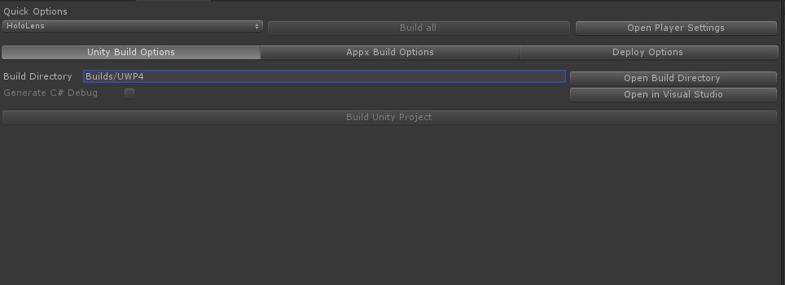
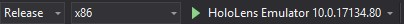

# Deploying to the HoloLens emulator

Hopefully we have set everything up right so that we can deploy our application to the HoloLens emulator. 

:pencil2: First go to **Mixed reality -> Build window**. This will open a new build panel for us. For me it opens at the same spot as the Scene panel.

You don't have to, but you can set the first setting under **Quick options** to HoloLens. 

:information_source: I've had issues with the various errors when building the application to the same folder. I usually change build direction each time I build to avoid them. You might have a better way of solving this, so build to the directory you want. 

Click **Build Unity Project**

When it is done, you will be prompted. Click **Ok**, then **Open in Visual Studio** from the Build panel. 

In Visual Studio change from **Debug** to **Release**, **ARM** to **x86** and set the build target to **HoloLensEmulator**. 

Click on the **HoloLensEmulator** to build. 

If all goes well your application should be deployed to the HoloLens emulator. 

:information_source: Even though the emulator might work fine for development I would recommend to build and test often on the HoloLens itself if you have one available. This will prevent you from spending time adjusting the GUI just to find that the sizing and positioning does not work in the HoloLens, or that some features that work in the emulator might not work on the device itself. 

:information_source: The build and deploy process will be the same for deploying to the HoloLens.

:arrow_backward: [Task 2 - Creating an application](TASK2.md) [Task 4 - Play with the toolkit](TASK4.md) :arrow_forward: