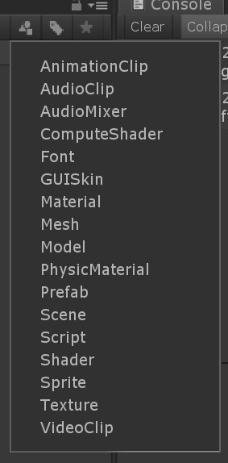

# Task 4 - Play with the toolkit

## Try out the interactable script

The SDK comes with an interactable script that you can use to make stuff clickable. Try it out!

:pencil2: Use Chester, a shape or your own 3D-model to make something happen when you click on it. You can for example move, rotate, scale, add text, or change color. To use the script, simply add it as a component to your 3D-model.

## Add buttons
The MRTK offers a few different kinds of buttons:
- AnimationButton
- Button
- HolographicButton
- HolographicButtonToggle
- SimpleButton
- ToggleButton
- Toggle

If you want to try them out, make sure you add a prefab button to your scene. A prefab is an object prefabricated with for example scripts, child components, or materials. 

## Try out the different types of materials the MRTK offers

Try out the different types of materials the MRTK offers. 

:pencil2: You can find them by searching for "mrtk" in the project panel. You can use them on different types of shapes.

## Check out the examples

If we are short on time or you're not feeling confident writing code, you can check out the MRTK-examples. You can download them from [here](https://github.com/Microsoft/MixedRealityToolkit-Unity/releases). It's the package with examples in the name. 

To import the package go to **Assets -> Import package -> Custom package** in the toolbar. Import the Microsoft.MixedReality.Tookit.Unity..Foundation-v2.0.0-Beta2.unitypackage downloaded from https://github.com/Microsoft/MixedRealityToolkit-Unity/releases/tag/v2.0.0-Beta2.

Make sure all assets are checked and click **Import**.

When the assets are done loading, you can filter the files in the project panel by **Scene**.

Each scene can be loaded and viewed. You can also deploy them to the HoloLens emulator if you want to get a better look. 

To deploy a new scene, remember to go to **File -> Build settings** and click **Add open scenes**. Un-check the previous scene as to change scenes in the application we need to implement a scene loader logic. Build as described in [task 3](TASK3.md)

:information_soruce: One of the coolest features of the HoloLens is the spatial mapping, but because the MRTK is missing a lot of documentation at this point and that Spatial Mapping is best tested on the HoloLens device itself, I've excluded that from this workshop. Maybe next year!

:arrow_backward: [Task 3 - Deploying to the HoloLens emulator](TASK3.md) 